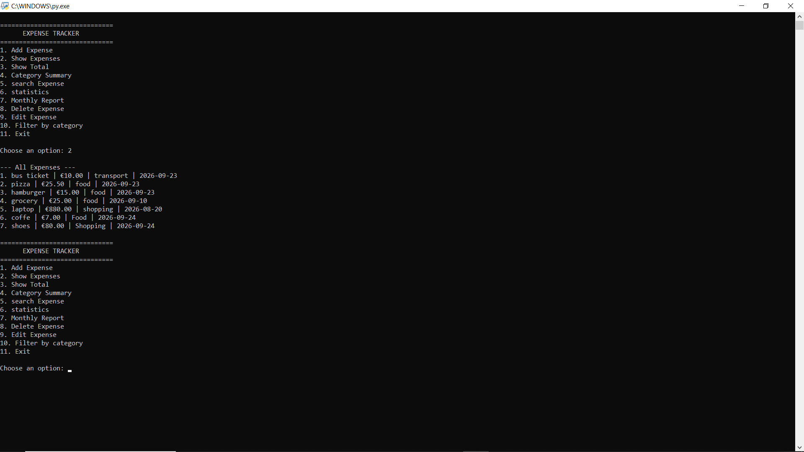

# 💰 Python Expense Tracker

A command-line expense tracking application built with Python for managing personal expenses through a simple and structured interface.

The application stores expense data locally in a JSON file and provides features for adding, editing, deleting, searching, filtering, and analyzing expenses.

## 📸 Application Preview



## ✨ Features

- ➕ Add new expenses
- ✏️ Edit existing expenses
- 🗑️ Delete expenses
- 🔎 Search expenses by title or category
- 🗂️ Filter expenses by category
- 💰 Calculate total expenses
- 📊 Calculate average expenses
- 🏆 Find the highest expense
- 📁 Display category summaries
- 📅 Generate monthly reports
- 🗓️ Use custom expense dates
- 💾 Persistent local data storage with JSON
- ✅ Input validation and error handling

## 🛠️ Technologies

- Python 3
- JSON
- File I/O
- `datetime`
- Lists & Dictionaries
- Functions
- Exception Handling

## 📂 Project Structure

```text
python-expense-tracker/
│
├── expense_tracker.py
├── expenses.json
├── README.md
└── .gitignore
```

## 🚀 Getting Started

### 1. Clone the repository

```bash
git clone https://github.com/Ahmadreza7577/python-expense-tracker.git
```

### 2. Navigate to the project directory

```bash
cd python-expense-tracker
```

### 3. Run the application

```bash
python3 expense_tracker.py
```

On Windows, you can also use:

```bash
python expense_tracker.py
```

## 📋 Main Menu

```text
==============================
      EXPENSE TRACKER
==============================
1. Add Expense
2. Show Expenses
3. Show Total
4. Category Summary
5. Search Expense
6. Statistics
7. Monthly Report
8. Delete Expense
9. Edit Expense
10. Filter by Category
11. Exit
```

## 💾 Data Storage

Expense data is stored locally in:

```text
expenses.json
```

Each expense contains:

```json
{
    "title": "Coffee",
    "amount": 5.0,
    "category": "Food",
    "date": "2026-09-20"
}
```

## 🔎 Example

```text
--- Total Expenses ---
Total: €132.50
```

The application also provides category summaries, monthly reports, statistics, search, filtering, editing, and deletion functionality.

## 🎯 Project Goals

This project was built to practice and demonstrate:

- Python fundamentals
- File handling
- JSON data persistence
- Input validation
- Working with lists and dictionaries
- Modular function design
- Basic data analysis
- Command-line application development

## 👨‍💻 Author

**Ahmadreza**

GitHub:  https://github.com/Ahmadreza7577